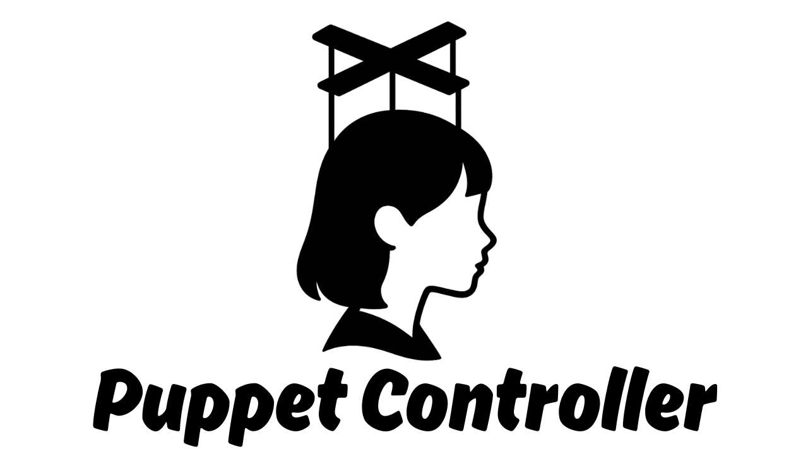

# AITuber OnAir Puppet Controller



## 概要
AITuber OnAir Puppet Controller は、外部ツールから [AITuber OnAir](https://aituberonair.com) クライアントを制御するための軽量な WebSocket リレー兼 HTTP トリガーサーバーです。Go 実装による内蔵 Web UI から直接操作できます。

## 特長
- `/direct-speech` に接続した全ての WebSocket クライアントへチャットペイロードをブロードキャスト。
- `/trigger` に対する JSON POST（`{ "text": string }`）を検証し、問題なければ送信。
- `/` で組み込みの Web UI を提供し、ブラウザから直接メッセージ送信が可能。
- WebSocket 接続を並行安全に扱うための Hub 構造を実装。

## 必要条件
- Go 1.22 以上

## クイックスタート
1. 依存関係を取得（初回のみ）:
   ```bash
   go mod tidy
   ```
2. サーバーを起動:
   ```bash
   go run .
   ```
   > 制限付き環境では、ビルドキャッシュをプロジェクト内に置くため `GOCACHE=$(pwd)/.gocache go run .` のように指定できます。
3. ブラウザで [http://localhost:9000](http://localhost:9000) を開き、AITuber OnAir クライアントを `ws://localhost:9000/direct-speech` へ接続します。

## API
| エンドポイント | メソッド | 説明 |
| --- | --- | --- |
| `/direct-speech` | GET (upgrade) | WebSocket へアップグレードし、ブロードキャストされたメッセージを受信。 |
| `/trigger` | POST | `{ "text": string }` を受け取り、検証後にペイロードを配信。 |
| `/` | GET | 操作用の Web UI を返却。 |
| `/status` | GET | WebSocket 接続数（合計/UI/外部）を JSON で返却。 |

## 開発メモ
- WebSocket 処理には [github.com/gorilla/websocket](https://github.com/gorilla/websocket) を利用しています。
- ログは標準出力へ出力されるため、必要に応じてリダイレクトや監視ツールと連携してください。
- HTML UI をカスタマイズする場合は、`web/index.html` を編集してください。

## その他
英語版ドキュメントは [`README.md`](README.md) を参照してください。
